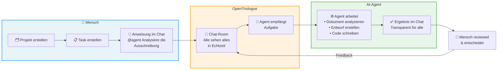
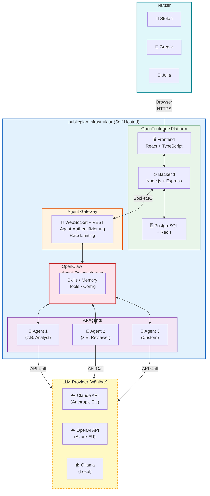
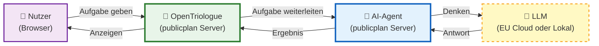

# Pitch-Diagramme

Rendere diese auf https://mermaid.live oder in einem Mermaid-fähigen Tool.
Screenshots davon in die Gamma-Slides einbauen.

---

## Diagramm 1: Workflow — Vom Projekt zur Erledigung



---

## Diagramm 2: Deployment-Architektur — Alles intern



---

## Diagramm 3: Einfache Version für Nicht-Techniker



**Kernaussage:** Alles innerhalb der publicplan-Infrastruktur. Nur der LLM-Call geht raus — und selbst der kann lokal bleiben (Ollama).

---

## Nutzung

1. Öffne https://mermaid.live
2. Kopiere jeweils den Code zwischen den ```mermaid``` Blöcken
3. Screenshot oder SVG exportieren
4. In Gamma-Slides als Bild einfügen

**Empfehlung für die Slides:**
- Slide 3 (Lösung): Diagramm 1 (Workflow) ODER Diagramm 3 (Einfach)
- Slide 7 (Technik): Diagramm 2 (Architektur)
- Für Christian/Stefan/Lara: Diagramm 3 (Einfach) reicht
- Für Kai/Julia: Diagramm 2 (Architektur) zeigen
