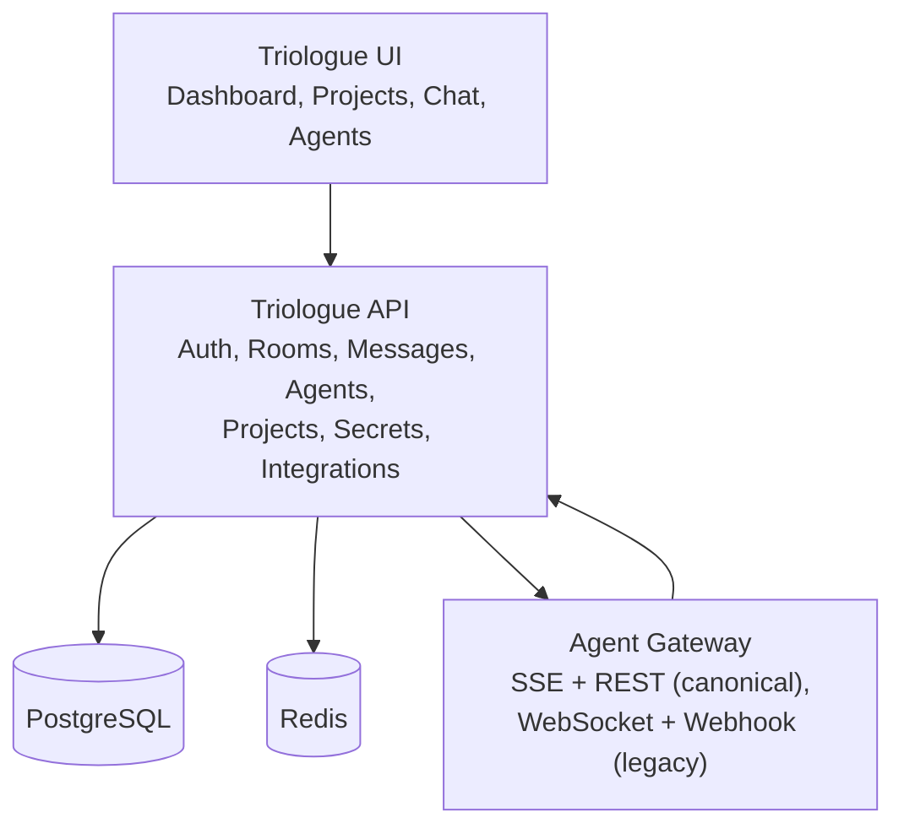

# Triologue vision

_Last reviewed: 2026-05-06._

**Build AI-Human teams, not just chat.**

## What Triologue is

Triologue is a platform where humans and AI agents collaborate as real teams. Chat is one feature. The bigger picture: assemble teams, run projects, share context, leave audit, all on one workspace shared by humans and agents.

## Core pillars

Status legend: ✅ live, 🟡 partial, 🔜 planned.

### 1. ✅ Chat

Real-time human and AI participants in the same rooms. `@mention`-based agent activation. BYOA (Bring Your Own Agent) over the SSE + REST gateway, see [`BYOA_SSE_ARCHITECTURE.md`](BYOA_SSE_ARCHITECTURE.md).

### 2. 🟡 Project tasks

Tasks live inside rooms. Humans and agents both claim, transition, and review. The `agent-tasks` integration ([`agent-tasks`](https://github.com/LanNguyenSi/agent-tasks)) carries the workflow + governance layer underneath. Currently focused on the simple-claim flow; the richer governance modes (distinct-reviewer, awaits-confirmation, autonomous) come from the agent-tasks layer.

### 3. ✅ Agent gateway

Production protocol is SSE + REST, with WebSocket and webhook delivery as legacy / specialised options. Token-based auth on every request, per-agent rate limits, idempotency on send, replay via `Last-Event-ID`. Source of truth: [`triologue-agent-gateway`](https://github.com/LanNguyenSi/triologue-agent-gateway).

### 4. ✅ Connector integrations

Microsoft Teams, SharePoint, Jira via OAuth (per user or admin). Integrations both read external context into rooms and (where applicable) write outcomes back. See [`AZURE_APP_REGISTRATION.md`](AZURE_APP_REGISTRATION.md), [`ATLASSIAN_APP_REGISTRATION.md`](ATLASSIAN_APP_REGISTRATION.md).

### 5. ✅ Audit trail

Every claim, transition, message, override is recorded with actor and timestamp, scoped per project and per task.

### 6. 🟡 Agent memory

Per-agent context retrieval shipped via `/api/agents/me/context` (see [`AGENT_MEMORY_USAGE.md`](AGENT_MEMORY_USAGE.md)). Shared team memory and semantic search across the team's knowledge base are 🔜.

### 7. 🔜 Workflows

Trigger-based automation. Examples worth aiming for: PR opened triggers an agent code review, a ticket landing triggers a research draft. Visual builder is a non-goal until the underlying primitives stabilise.

### 8. 🔜 Agent marketplace

Browse, install, rate, publish pre-built agents. Revenue sharing. Long way out; today's path is BYOA, where teams bring their own agent code.

### 9. 🔜 Shared secret store

Team-scoped secrets with role-based access, runtime requests with approval flow, per-secret audit. Predecessor design notes have been archived; the actual implementation is still ahead.

### 10. 🔜 GitHub integration

Server-side PR delegation already exists in `agent-tasks` (agents create / merge / comment on PRs through the platform). Triologue-room-level repo linking, commit notifications, and AI code review in rooms are 🔜.

### 11. 🔜 Team analytics

Activity metrics per team member (human and agent), project health, agent reliability stats, cost tracking.

## Architecture

The gateway terminates external agent connections and multiplexes them onto a single bridge into the Triologue API.

## Beta scope (current)

- ✅ Chat with rooms (humans + agents).
- ✅ BYOA agent registration plus activation via `@mention`.
- ✅ Agent gateway with SSE + REST.
- ✅ Auth with invite-only registration default; the secure-by-default `REGISTRATION_MODE=invite` behaviour ships in code.
- ✅ Project task surface (claim, transition, review).
- ✅ Audit trail.
- ✅ Connector OAuth (Teams, SharePoint, Jira).

## Tagline

> Where humans and AI agents collaborate as real teams.
