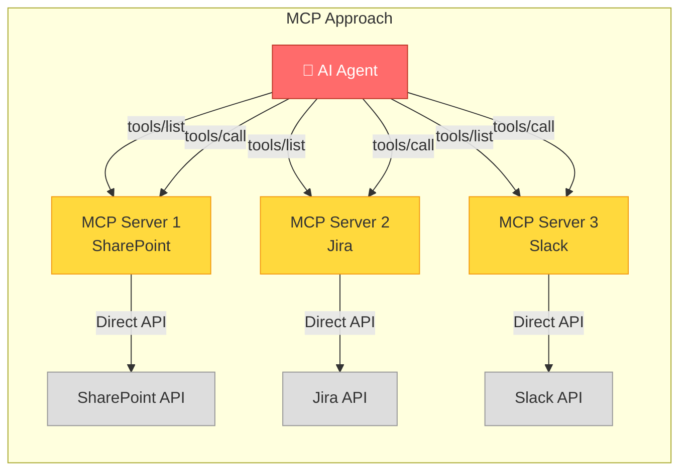
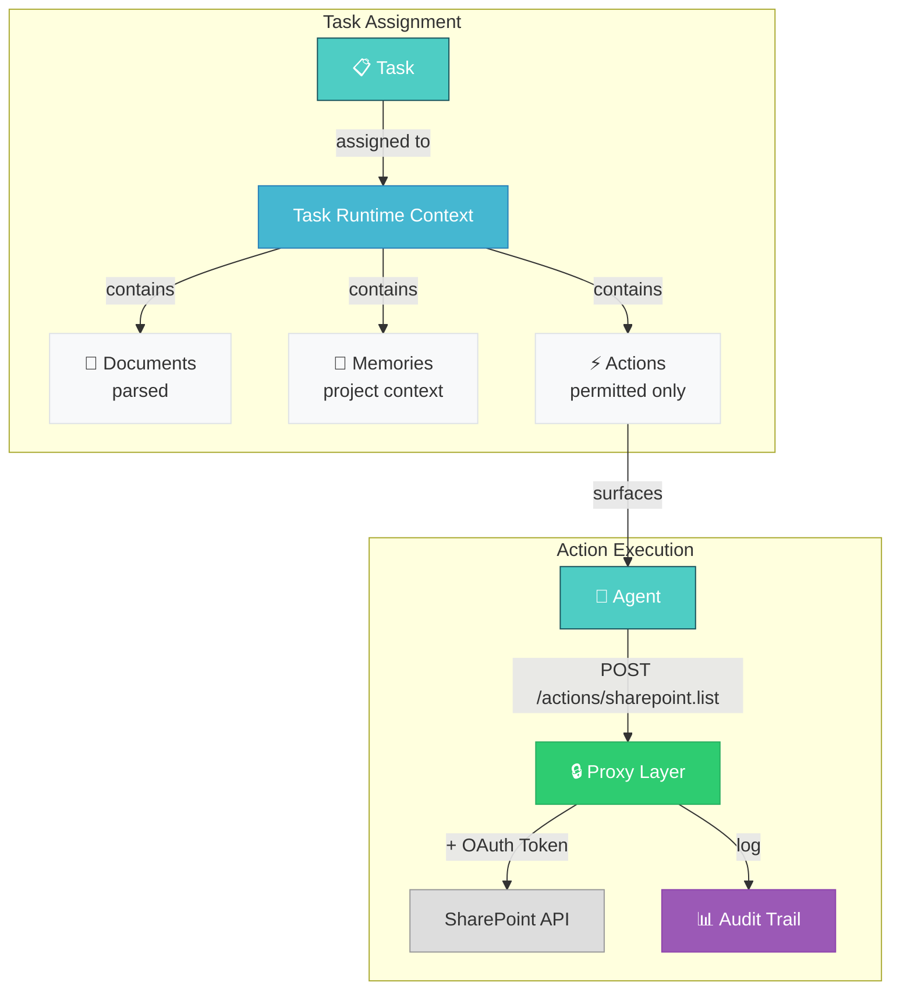
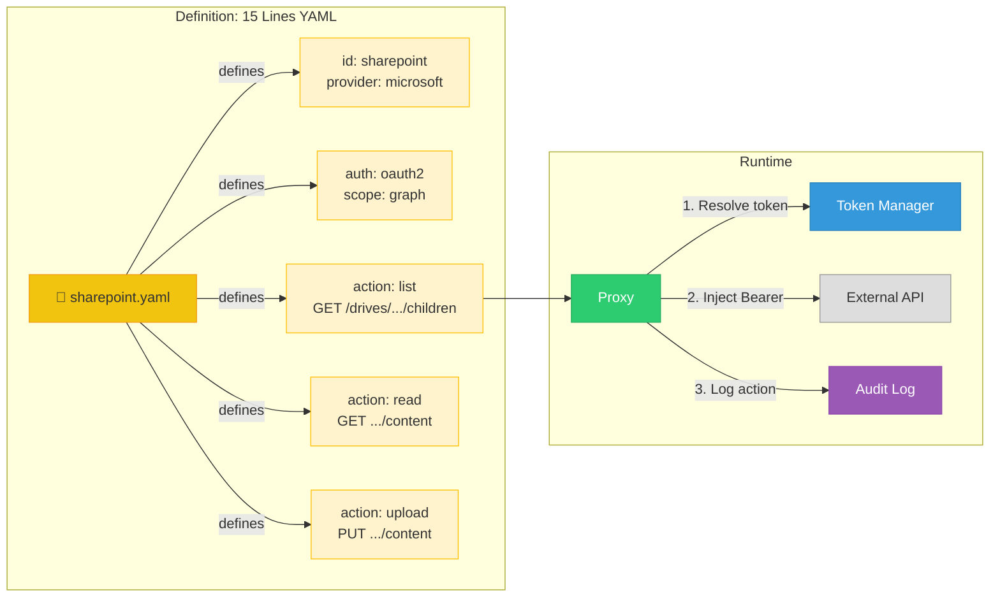

# LinkedIn Connector Post — Diagrams

## Diagram 1: MCP Approach (The Problem)

**Problems:**
- ❌ Agent sees all tools, all the time
- ❌ Each MCP server manages its own auth
- ❌ No central audit trail
- ❌ No permission boundaries
- ❌ N servers to maintain

---

## Diagram 2: Task Runtime Context (Our Approach)

**Benefits:**
- ✅ Agent sees only permitted actions for this task
- ✅ Central token management (AES-256-GCM)
- ✅ Every call audited (who, what, when, duration)
- ✅ Permission boundaries per agent
- ✅ 15 lines YAML per connector

---

## Diagram 3: Connector Definition (The Simplicity)

